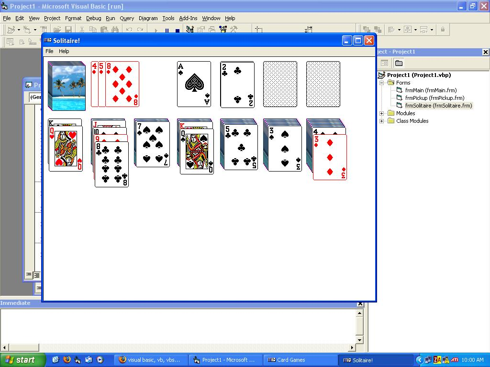



## \[\* Solitaire\! \*\]

### Description

Solitaire! This is a remake of the solitaire game that comes with Windows. I'm pretty sure there aren't any bugs, at least none that I've come across. Updated: added options, scoring, time and the ability to choose your deck back! The only difference between mine and Microsoft's now is undo.
 
### More Info
 
Caution: using this program will make the monkey that lives in your monitor get very angry and cause him to try and smash your brains in. You have been warned!

             |
---                |---
**Submitted On**   |2005-03-13 23:09:08
**By**             |[Calvin Mayer](https://github.com/Planet-Source-Code/PSCIndex/blob/master/ByAuthor/calvin-mayer.md)
**Level**          |Advanced
**User Rating**    |4.8 (43 globes from 9 users)
**Compatibility**  |VB 6\.0
**Category**       |[Games](https://github.com/Planet-Source-Code/PSCIndex/blob/master/ByCategory/games__1-38.md)
**World**          |[Visual Basic](https://github.com/Planet-Source-Code/PSCIndex/blob/master/ByWorld/visual-basic.md)
**Archive File**   |[\[\_\_Solitai1864203142005\.zip](https://github.com/Planet-Source-Code/calvin-mayer-solitaire__1-59454/archive/master.zip)

